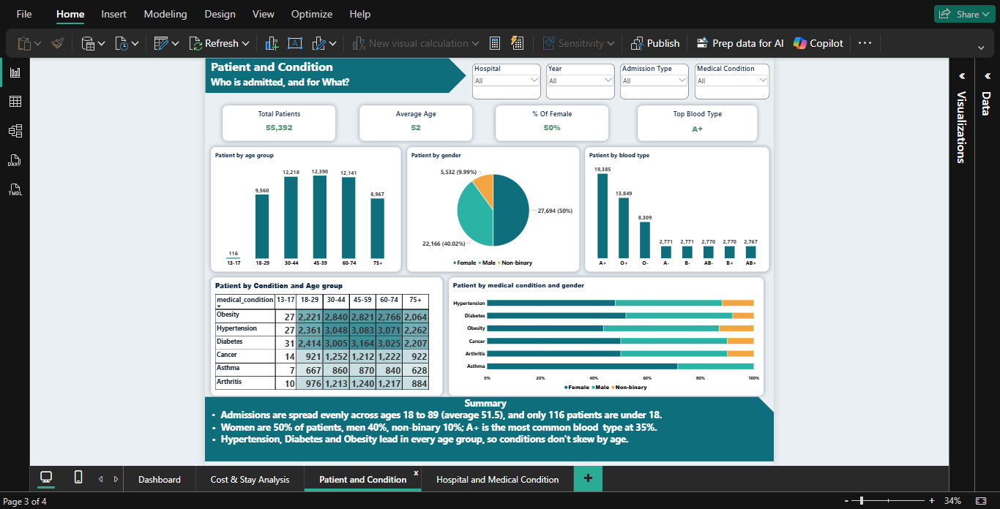

# US Healthcare Analytics

A portfolio project combining a Power BI report with MySQL analysis of healthcare admissions, diagnoses, length of stay, billing, hospital outcomes, medications, insurance, and location patterns.

The embedded data in the Power BI report is synthetic, as confirmed by the project owner. The separate source CSV is not included. No license is provided; the project remains subject to applicable default copyright rules.

## Project snapshot

The report summarizes **55,392 patient records** across **May 2019–May 2024**.

| Report metric | Result |
|---|---:|
| Total patients | 55,392 |
| Total billing | $1.42 billion |
| Average billing | $25,590 |
| Average length of stay | 15.5 days |
| Abnormal test results | 54.99% |

### Key findings

- **Most frequent conditions:** Hypertension (13,852), diabetes (13,846), and obesity (12,739).
- **Hospital volume:** Houston Methodist reported 20,362 patients and Johns Hopkins 11,248; together they represent about 57% of reported volume.
- **Demographics:** Average age is 52. The report shows 50% female, 40.02% male, and 9.99% non-binary; A+ is the most common blood type (19,385, about 35%).
- **Cost and stay:** Average billing across the listed conditions ranges from about $25.34K to $25.77K. Average stay ranges from 15.39 to 15.63 days.
- **Billing by insurer:** Medicare accounts for 49.91% of billing, UnitedHealthcare 30.06%, and Cigna and Aetna about 10% each.
- **Hospital concentration:** The two largest hospitals account for 57.1% of patient volume.

The SQL cleaning view excludes records with negative billing amounts; the script documents 108 such rows. These are descriptive results from synthetic data and should not be interpreted as real-world clinical outcomes, population statistics, or healthcare cost benchmarks. Figures are reported as displayed in the dashboard, so rounded values may not add exactly.

## Dashboard screenshots

### Overview

### Cost and stay analysis

### Patient and condition

### Hospitals and medications

## What’s included

- `US_Healthcare_Project.pbix` — Power BI report with four pages: Dashboard, Cost & Stay Analysis, Patient and Condition, and Hospital and Medical Condition.
- `sql/healthcare_analysis.sql` — MySQL schema, data-quality checks, a cleaned analytical view, and queries for demographics, conditions, length of stay, cost, outcomes, medications, insurance, geography, and time trends.
- `data/` — local input data location. The CSV is excluded; place an authorized `healthcare_data.csv` here.

## Requirements

- Power BI Desktop on Windows to open the report.
- MySQL 8.0 or later to run the SQL analysis (it uses window functions).
- A CSV named `healthcare_data.csv` with columns matching the table definition in the SQL script. The data file is not included.

## Use the Power BI report

Open `US_Healthcare_Project.pbix` in Power BI Desktop. The file contains its own embedded synthetic model. For refreshes, configure the report to use your authorized data source.

## Run the SQL analysis

1. Place an authorized `healthcare_data.csv` file in `data/`.
2. From the repository root, open `sql/healthcare_analysis.sql` in a MySQL client and execute it.
3. If MySQL rejects local file loading, enable `LOCAL INFILE` on both the server and client according to your MySQL installation’s security guidance.

The script creates `healthcare_db`, loads the CSV, creates `healthcare_clean`, and runs the documented analysis queries. The clean view excludes rows with negative billing amounts and derives age groups and length of stay. Initial quality checks report row and distinct-patient counts, negative billing rows, and the admission date range.

## Contributions and security

Please do not include patient-level records, credentials, or other sensitive information in issues or pull requests. See [SECURITY.md](SECURITY.md) for reporting guidance.

